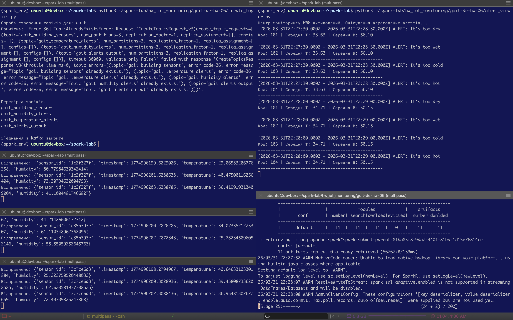
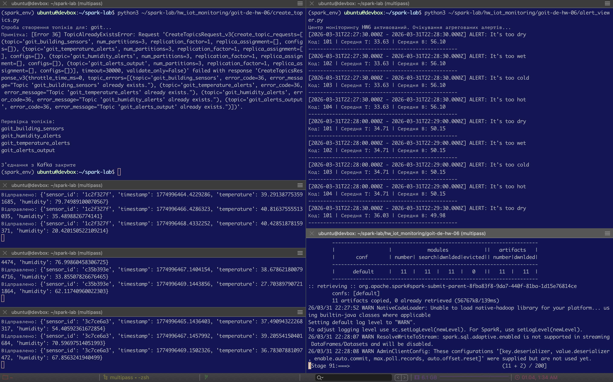

# Apache Kafka - IoT Monitoring
## Аналіз IoT даних за допомогою Spark Structured Streaming

Цей проект реалізує складний конвеєр обробки даних з використанням віконних функцій та динамічних правил фільтрації.

## Опис компонентів:
* `sensor_producer.py`: генерує безперервний потік даних від декількох датчиків.
* `spark_processor.py`: основний вузол обробки на PySpark (Sliding Window 1 хв, Watermark 10 сек).
* `alerts_conditions.csv`: зовнішній файл конфігурації з порогами спрацювання алертів.
* `alert_viewer.py`: клієнт для відображення агрегованих результатів.

---

## Результати виконання

### 1. Генерація даних
Демонстрація роботи двох паралельних датчиків, що надсилають дані в Kafka.

### 2. Агрегація та виявлення алертів
Результат роботи Spark Streaming. Видно вікна агрегації, середні значення та повідомлення, згенеровані на основі `crossJoin` з CSV-файлом.
